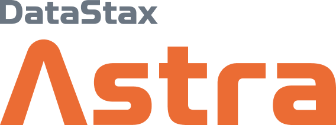

# 🛝 Vector Search playgrounds 🛝
This repo contains multiple examples on how to use Vector Search with a selection of databases.
The goal is to learn how to set them up, how to connect and how to semantically query the database. In some instances there's an integration with the popular framework [LangChain](https://python.langchain.com/docs/get_started/introduction).

## 

[DataStax](https://www.datastax.com) has made [Vector Search available for Apache Cassandra](https://cwiki.apache.org/confluence/pages/viewpage.action?pageId=255069753) and integrated it into their DBaaS [Astra DB](https://astra.datastax.com). Not only is this probably the best and fastest implementation of Vector Search, it's also integrated into the Assistant on the management interface for Astra DB.

The following collections of Google Colab notebooks show how easy and simple it is to use Astra DB as a Vector Database:

- [Vector Search in 4 lines of code with AstraDB / Cassandra (with CassIO)](https://colab.research.google.com/drive/1tF00Soc0uQfKfhfT9R7W72MM6AMGePoE)
- [Image Search](https://colab.research.google.com/drive/11c9ijhndGSZjdEpqeaxipJZDPgRV3Z64)
- [Retrieval Augmented Generation](https://colab.research.google.com/drive/1Eyf-fOIU8uKNn4p91szLVbMDWN8i7Ot_)

### Strategies
A lot of strategies are available to increase the relevancy of agent and chatbot interaction. A very well know pattern is Retrievel Augmented Generation (RAG).
As AstraDB now also supports Full-Text searching, there is a new opportunity for increasing relevancy using Hybrid Search.

Check out the following example that introduces Keyword Augmented Search (KAG):
- [Keyword Augmented Search](./hybrid-search/README.md)

### How do I run all of this in production?
Colab and notebooks in general are great for prototyping. Langchain has a python package available for that. Astra DB is integrated in that as well.

But how to run al of this in production?

Easy! Use Langchain.js and have a look at this example:
- [Production quality Generative AI with Langchain.js, Node.js, Astra DB and TypeScript](./langchainjs-typescript-examples/README.md)

## Other Vector Search solutions

For all the folowing tests, Google Colab notebooks are available in the repo as well:

- [MongoDB](./vector-mongodb/README.md)
- [Neo4J](./vector-neo4j/README.md)
- [PGVector](./vector-pgvector/README.md)
- [Redis](./vector-redis/README.md)
- [Weaviate](./vector-weaviate/README.md)

## Conclusion
Most of the tests above are merely a `hello-world` example, they are not meant to be extensive. However it is interesting to be pointed to some intersting quick findings:
### Astra DB
-  Astra DB has SOC2 Type2, Hipaa and is PCI compliant for your most demanding workloads
- Astra DB provides more capabilities and better integrations for increased developer productivity:
    - K/V, Table based, Document based
    - Document API, Automation and DevOps API
- Comprehensive DBaaS offering with Enterprise features for robustness including: Monitoring, RBAC, Private Link, IP whitelisting
- 100s of happy customers in production with 90% of the fortune 100 using DataStax technology
- Most organizations have their data in Cassandra already. With Astra DB it’s easy to add vector embeddings and get going with GenAI!
### MongoDB
- Easy to set up in the cloud
- Nice UI for index management
- Only KNN searches from which performance will suffer
- Nice integration with LangChain
### Neo4J
- Easy to set up in the cloud
- Supports ANN indexing
- For most Vector use cases, I don't like to complex query language
### PGVector
- Interesting layer over PostgreSQL compatible databases
- It's an add-on
- Only supports up to 2000 dimensions
### Redis
- I used the option to run Redis inside the Colab execution environment which makes for a quick start
- Index creation is pretty simple
- Only KNN searches from which performance will suffer
- Query syntax is pretty straighforward
### Weaviate
- Nice and uncluttered query language
- Modular approach takes some complexity out of using vectorizers and LLMs
- Specializes as a Vector Store only
- No role based access

