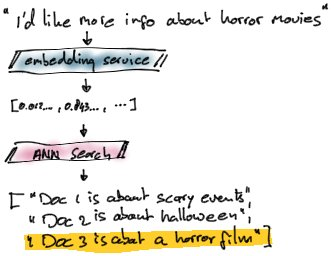
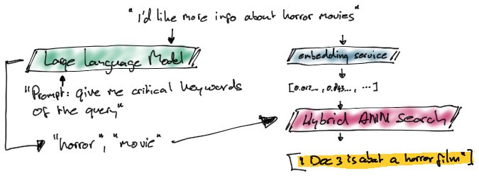

# Hybrid Vector Search with Astra DB
Vector Search provides a magical experience for similarity searches. It's a perfect solution for Retrievel Augmented Generation (RAG) in combination with LLMs for Natural Language Interaction.

There's a catch though!

As Vector Search, often implemented through searching for Aproximate Nearest Neighbours (ANN), returns results where their Vector is closest to the Vector of the question, it is exactly that: an Approximate and Closest match. This is shown in the following diagram:

In this example the user searches for `I'd like more information about horror movies`. Because of the similarity search, the resulst will include other documents than strictly about horror.

## Keyword Augmented Search
Sometimes you just want a bit more. If you're looking for higher quality results (also called relevancy).

For that i'd like to introduce a new idea: Keyword Augmented Search.

The following diagram explains the strategy:

In order to query more specifically we're calling in the help of a Large Language Model (LLM). We're using the LLM to come up with an analysis of the most important keywords given the user question.

Then, using Hybrid Search we're combining a Full-Text search and an ANN search to reduce the results and filter out irrelevant hits.

This greatly improves the quality of the results which then ofcourse can be passes on to an LLM again in relation to a RAG implementation.

## Colab notebook

[Back to top](../README.md)